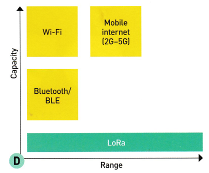
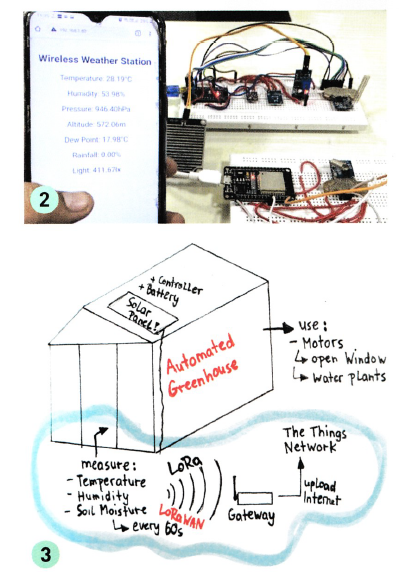

# Plan

- nom d'équipe
- nom du projet
- valeurs de l 'équipe
- moto, inspiré d'Agile
- rôles et non-rôles
- description des rôles et des valeurs

## Cahier de charge

- faire durant la 1re semaine
    - le client et le maitre d'ouvrage pour les besoins
    - le maitre d'oeuvre exécute le travail pour satisfaire les besoins du client
- présentation du projet

### Contexte

…

### Objectifs

- décrire un feature
- feature
- …

### Limites

- ce qui est non couvert
- non couvert
- …

### Critère d'acceptabilité

- décrire les critères de validation
- métriques, mesures
- temps, durée
- budget
- etc.

### Expression des besoins

- besoins fonctionnels
- besoins non fonctionnels

### Développement du projet

- planification
- équipe
- organisation de l'équipe
- outils
- gestions des imprévus (bris, inventaire, maladie, serveur, électricité, bogues, etc.)
- base de données

### Autres

- wireframes, schémas, plans, gitflow, etc.